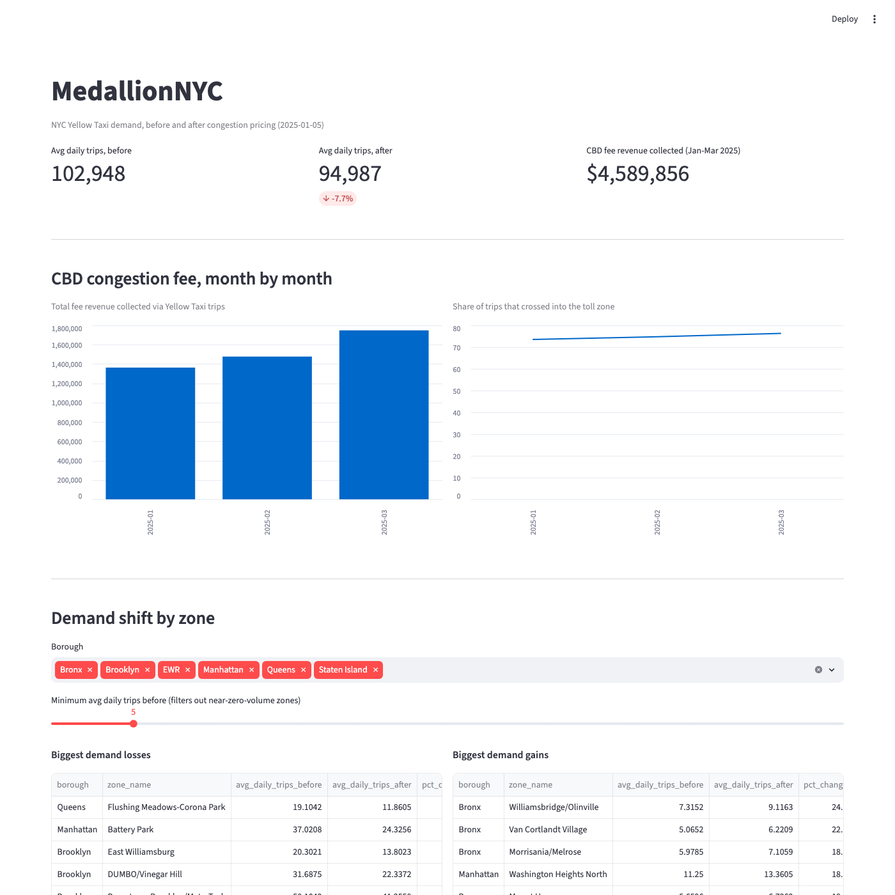

# MedallionNYC

[](https://github.com/kartik117/MedallionNYC/actions/workflows/ci.yml)

A medallion-architecture (Bronze/Silver/Gold) lakehouse analyzing how NYC Yellow Taxi demand shifted across taxi zones after congestion pricing — the Central Business District Tolling Program — took effect on January 5, 2025.



## The finding

Citywide average daily Yellow Taxi trips fell from **102,948 to 94,987 (-7.7%)** comparing three months before vs. three months after the toll started. The decline isn't uniform across the city:

- Zones **inside or at the edge of the toll zone** dropped the most: Battery Park -34.3%, Seaport -25.9% (both lower Manhattan).
- Brooklyn zones at the **bridge/tunnel approaches into Manhattan** also fell sharply: DUMBO/Vinegar Hill -29.5%, Downtown Brooklyn/MetroTech -29.0%, Williamsburg (North Side) -24.0%.
- The **Bronx — entirely outside the toll zone — gained instead** (+11.6% average across its zones), as did Washington Heights North: Manhattan, but north of the 60th St toll boundary.

That pattern — losses concentrated inside the zone and at its access points, gains concentrated just outside it — is consistent with real demand displacement, not random noise. It's a descriptive six-month comparison, though, not a causal study; the window also covers a seasonal transition (fall into winter), which a rigorous causal claim would need to control for.

The toll itself shows up directly in the data: a `cbd_congestion_fee` column appears starting exactly in January 2025 (verified against the raw files, not just documentation). Fee revenue collected via Yellow Taxi trips alone climbed from $1.36M (Jan) to $1.48M (Feb) to $1.75M (Mar), with the share of trips entering the zone rising from 73.5% to 76.3%.

## Architecture

```
TLC trip data (CloudFront, public HTTPS)
  -> Bronze: raw parquet, as-is, no transforms
  -> Silver: PySpark cleaning + schema normalization -> Delta Lake
  -> Gold: zone/hour metrics, demand-shift comparison, CBD fee summary -> Delta Lake
  -> Streamlit dashboard (queries Gold directly via DuckDB)

3 Airflow DAGs (ingest -> transform -> aggregate), chained with
Airflow Datasets so each stage triggers the next automatically.
```

## Stack

PySpark · Delta Lake · Apache Airflow · DuckDB · Streamlit · Docker

## Running it

**The pipeline (Bronze -> Silver -> Gold), without Airflow:**

```bash
python3.11 -m venv .venv
source .venv/bin/activate
pip install -e ".[dev]"

export JAVA_HOME=/opt/homebrew/opt/openjdk@17/libexec/openjdk.jdk/Contents/Home  # adjust for your platform

python -m medallion_nyc.bronze.ingest
python -m medallion_nyc.silver.clean
python -m medallion_nyc.gold.aggregate
```

**The dashboard:**

```bash
streamlit run app/dashboard.py
```

**Orchestrated via Airflow (Docker):**

```bash
docker compose up --build
```

Airflow UI on `localhost:8080` (admin/admin). Trigger `medallion_nyc_ingest`; `medallion_nyc_transform` and `medallion_nyc_aggregate` fire automatically afterward via their dataset dependencies.

## Testing

```bash
pip install -e ".[dev]"
pytest        # all PySpark transformations tested against small in-memory DataFrames
ruff check .
```

## Engineering notes

- **PySpark 4.1.1 (the unpinned latest) has a real bug** on this Python version — `GeographyType` fails to import (`unsupported operand type(s) for |`). Pinned to `pyspark<3.6` / `delta-spark<3.3`, the well-established pairing, instead of chasing it down further.
- **Spark's worker subprocesses launched under the wrong Python** (system 3.9 instead of the venv's 3.11) and refused to run (`PYTHON_VERSION_MISMATCH`). Fixed by pinning `PYSPARK_PYTHON`/`PYSPARK_DRIVER_PYTHON` to `sys.executable` in `spark_session.py`, so it's automatic regardless of how the venv is invoked — not just a one-off env var I'd have to remember.
- **A real data quality issue showed up only once the full dataset ran**: a small number of rows in every monthly TLC file have a corrupted pickup timestamp — some off by one month, some off by decades (year 2002 appears in real 2025 data). Caught by comparing each row's actual pickup month against which file it came from.
- **The brief assumed Databricks Community Edition and a similar AWS S3 path.** Verified both before writing code: TLC data now ships via CloudFront as plain HTTPS files (not the S3 SDK path), and Databricks Community/Free Edition needs a signup I can't do on someone else's behalf — so this runs on local PySpark + Delta Lake instead, with Databricks-equivalent semantics (same Spark APIs, same Delta tables) but no external account dependency.
- **Config path resolution broke once the package left its source checkout.** `DATA_DIR` was computed relative to the installed file's location, which only works when running from a git clone — not once pip-installed into the Airflow container. Made it overridable via an env var rather than assuming a project layout that doesn't exist inside a container.
- **Airflow DAG files import the heavy stuff (pyspark) inside task bodies, not at module level** — the scheduler re-parses every DAG file on a timer, and a module-level pyspark import would start a JVM on every parse cycle, not just at task execution.

## License

MIT
